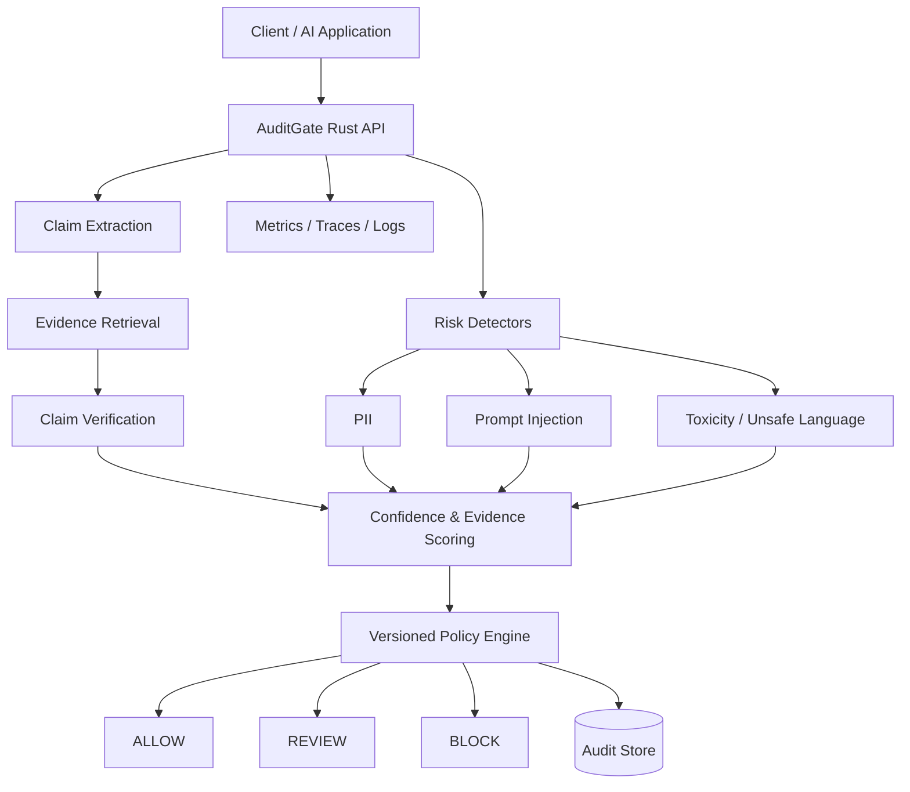

# AuditGate

**Evidence-grounded decision engine for responsible NLP systems.**

AuditGate is a Rust-based service for auditing text before it is shown to a user, stored, or passed downstream to another AI system. Instead of acting as a generic moderation or guardrail API, AuditGate focuses on a harder question:

> **When does an AI system have enough evidence and confidence to act automatically, and when should it abstain?**

Given an input text, AuditGate decomposes it into factual claims, retrieves supporting evidence, verifies each claim, evaluates additional safety and privacy signals, and combines those uncertain signals through a versioned policy engine.

The final output is one of three decisions:

* **ALLOW** — sufficiently supported and low risk
* **REVIEW** — uncertain, weakly supported, conflicting, or policy-sensitive
* **BLOCK** — strongly contradicted or subject to a high-severity policy rule

Every decision is designed to be **auditable**: the API returns evidence snippets, confidence values, model versions, policy metadata, decision reasons, latency information, and a persistent audit ID.

---

## Why AuditGate?

Production NLP systems rarely fail because a single classifier is completely unusable. More often, failures arise because downstream systems treat uncertain model outputs as if they were certain.

AuditGate treats uncertainty as a first-class engineering problem.

The project explores whether factual evidence, model confidence, detector uncertainty, and policy constraints can be combined into a decision layer that knows when **not** to automate.

### Core question

> **How can an NLP system combine imperfect evidence, calibrated model confidence, and heterogeneous risk signals to make auditable allow/review/block decisions while learning when to abstain?**

---

## System Overview



### Decision Pipeline

```text
text
  ↓
claim decomposition
  ↓
evidence retrieval
  ↓
claim verification
  ↓
risk detection
  ↓
confidence calibration
  ↓
versioned policy engine
  ↓
ALLOW | REVIEW | BLOCK
```

A key design principle is:

> **Insufficient evidence is not the same as contradiction.**

If AuditGate cannot establish whether a claim is true or false with sufficient confidence, the preferred outcome is **REVIEW**, not an unjustified automatic decision.

---

## Architecture

AuditGate is intentionally designed as a small number of well-defined production components rather than a collection of unnecessary microservices.

```text
┌──────────────────────────────┐
│        Client / AI App       │
└──────────────┬───────────────┘
               │
          POST /v1/audit
               │
               ▼
┌──────────────────────────────┐
│        AuditGate API         │
│      Rust + Axum + Tokio     │
│                              │
│  Claim extraction            │
│  Evidence retrieval          │
│  Verification                │
│  Risk detectors              │
│  Calibration                 │
│  Policy engine               │
└──────────────┬───────────────┘
               │
      ┌────────┼─────────┐
      ▼        ▼         ▼
 PostgreSQL  Metrics   Traces / Logs
             │
         Prometheus
```

ML components will be exposed behind internal interfaces so that inference backends can be changed without modifying the decision engine.

---

## Initial Scope

The first implementation focuses on a complete vertical slice rather than broad feature coverage.

### MVP

* Rust HTTP API using **Axum** and **Tokio**
* Claim decomposition for short factual passages
* Retrieval from a controlled local knowledge base
* Claim verification with `supported`, `contradicted`, and `insufficient_evidence` outputs
* Initial PII and prompt-injection detectors
* Confidence-aware **ALLOW / REVIEW / BLOCK** policy engine
* Structured JSON responses with evidence provenance
* Persistent audit IDs and model/policy metadata
* Structured logging and metrics
* Docker containerisation
* Kubernetes deployment with readiness/liveness probes
* Reproducible evaluation pipeline

### Stretch Goals

* Hybrid sparse + dense retrieval
* Evidence reranking
* Four-way verification with `partially_supported`
* Probability calibration
* Selective prediction / abstention optimisation
* Conflicting-evidence handling
* Human-review feedback loop
* ONNX inference from Rust
* Policy hot-reloading and versioning
* Drift monitoring
* Grafana dashboards
* Canary model deployment
* Live trusted-source retrieval

---

## API

### Audit Text

```http
POST /v1/audit
```

Example request:

```json
{
  "text": "The Eiffel Tower is located in Berlin and was completed in 1889.",
  "context": {
    "application": "assistant-demo",
    "user_id": "anonymous"
  },
  "policy_id": "default"
}
```

Example response:

```json
{
  "audit_id": "agt_01JAB8WK74Q2PXF3",
  "decision": "block",
  "decision_confidence": 0.94,
  "claims": [
    {
      "claim_id": "claim_001",
      "text": "The Eiffel Tower is located in Berlin.",
      "verification": "contradicted",
      "confidence": 0.98,
      "evidence": [
        {
          "document_id": "kb_00491",
          "snippet": "The Eiffel Tower is located on the Champ de Mars in Paris, France.",
          "retrieval_score": 0.91,
          "source_trust": 0.97
        }
      ]
    },
    {
      "claim_id": "claim_002",
      "text": "The Eiffel Tower was completed in 1889.",
      "verification": "supported",
      "confidence": 0.96
    }
  ],
  "risks": {
    "pii": {
      "detected": false,
      "score": 0.01
    },
    "prompt_injection": {
      "detected": false,
      "score": 0.01
    }
  },
  "policy": {
    "id": "default",
    "version": "1.0.0"
  },
  "models": {
    "retriever": "auditgate-retriever@0.1.0",
    "verifier": "auditgate-verifier@0.1.0"
  }
}
```

Additional planned endpoints:

```text
POST /v1/audit/batch
GET  /v1/audits/{audit_id}
GET  /v1/models
GET  /v1/policies
GET  /health/live
GET  /health/ready
GET  /metrics
```

---

## Evaluation Strategy

AuditGate will be evaluated as a **pipeline**, not simply as a single classifier.

### Evidence Retrieval

Planned metrics:

* Recall@k
* MRR
* nDCG@k

### Claim Verification

Planned metrics:

* Macro F1
* Per-class precision and recall
* Confusion matrix
* Negative log-likelihood
* Brier score
* Expected Calibration Error

### Selective Prediction and Abstention

A central experiment will evaluate whether AuditGate can improve reliability by routing uncertain examples to human review.

For a confidence threshold `τ`:

```text
confidence < τ  →  REVIEW
confidence ≥ τ  →  automated decision
```

The primary analysis will measure:

* **Coverage** — fraction of examples automatically decided
* **Selective risk** — error rate among non-abstained predictions
* **Risk–coverage curve**
* **Area Under the Risk–Coverage Curve (AURC)**
* False-allow rate
* Review rate

The project will compare strategies such as:

```text
random abstention
vs
raw model confidence
vs
calibrated confidence
vs
evidence-aware confidence
```

This allows the system to optimise not only prediction accuracy, but the more operationally relevant question:

> **Which predictions should be trusted enough to automate?**

---

## Failure Analysis

End-to-end errors will be decomposed by pipeline stage:

```text
claim extraction failure
retrieval failure
verification failure
calibration failure
detector failure
policy failure
```

This allows model failures to be distinguished from upstream evidence failures and downstream decision-policy failures.

---

## Technology Stack

### Systems

* Rust
* Axum
* Tokio
* Tower / tower-http
* Serde
* SQLx

### ML / NLP

* BM25 / lexical retrieval for the initial baseline
* Dense retrieval as a later extension
* NLI-based factual claim verification
* ONNX Runtime or external inference worker where appropriate

### Storage

* PostgreSQL
* Optional Qdrant vector store for dense retrieval

### Observability

* `tracing`
* OpenTelemetry
* Prometheus
* Grafana

### Infrastructure

* Docker
* Docker Compose
* Kubernetes
* Horizontal Pod Autoscaler
* GitHub Actions

---

## MLOps

AuditGate treats model behaviour as part of the deployable software contract.

Planned CI checks include:

```text
cargo fmt --check
cargo clippy
cargo test
integration tests
model evaluation regression tests
Docker image build
security scanning
```

Later evaluation gates may enforce constraints such as:

```text
minimum verification macro-F1
maximum calibration error
maximum false-allow rate
maximum P95 latency
```

Every production decision should be attributable to the exact model and policy versions that generated it.

---

## Kubernetes Deployment

The first Kubernetes deployment will include:

* `Deployment`
* `Service`
* `ConfigMap`
* `Secret`
* Readiness probe
* Liveness probe
* Resource requests and limits
* `HorizontalPodAutoscaler`

Load testing will report throughput and latency statistics including P50, P95, P99, request failure rate, and scaling behaviour under increasing concurrency.

---

## Repository Structure

Planned layout:

```text
.
├── src/
│   ├── api/
│   ├── claims/
│   ├── retrieval/
│   ├── verification/
│   ├── detectors/
│   ├── policy/
│   ├── audit/
│   ├── telemetry/
│   └── main.rs
├── tests/
├── data/
│   ├── corpus/
│   └── evaluation/
├── experiments/
├── policies/
├── deploy/
│   └── kubernetes/
├── dashboards/
├── Dockerfile
├── docker-compose.yml
├── Cargo.toml
└── README.md
```

The structure will evolve as implementation begins.

---

## Roadmap

### Phase 1 — Vertical Slice

```text
input → claims → evidence → verification → decision → JSON
```

### Phase 2 — Evaluation & Uncertainty

Calibration, abstention, risk–coverage evaluation, detector integration, and policy versioning.

### Phase 3 — Productionisation

Persistence, observability, Docker, Kubernetes, CI/CD, and load testing.

### Phase 4 — Research Extensions

Hybrid retrieval, evidence disagreement, reviewer feedback, model deployment experiments, and advanced selective prediction.

---

## Responsible AI Principles

AuditGate is designed around five principles:

1. **Evidence over unsupported confidence** — decisions should expose the evidence that justified them.
2. **Abstention over unjustified certainty** — uncertain cases should be routed for review rather than forced into an automatic decision.
3. **Traceability** — outputs should identify the models, policies, evidence, and thresholds involved.
4. **Separation of uncertainty from falsity** — inability to verify a claim is not evidence that the claim is false.
5. **Measurable safety trade-offs** — review rate, coverage, false allows, false blocks, and calibration should be quantified rather than hidden behind a single accuracy metric.

---

## Status

🚧 **Early development.**

The current repository defines the architecture, evaluation strategy, and implementation plan. Experimental results and benchmark numbers will be added only after they have been reproduced from the implemented system.

---

## License

MIT
